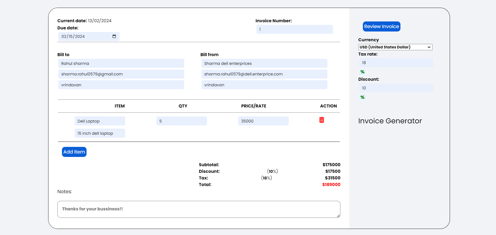
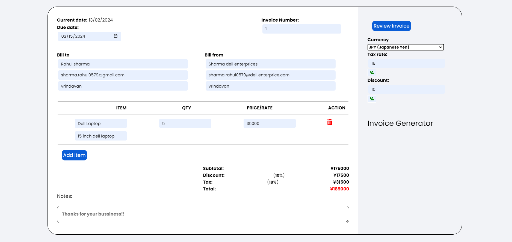
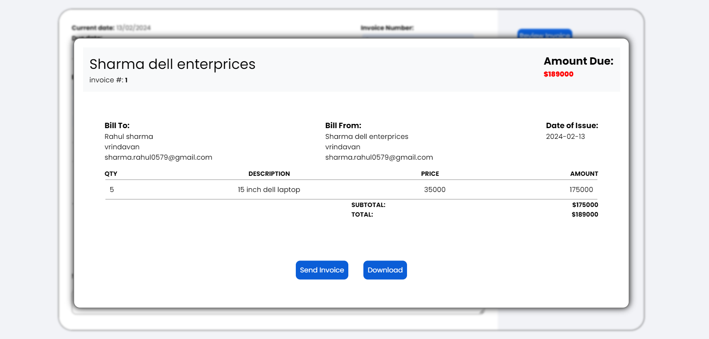
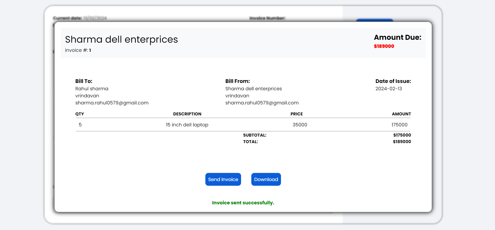

# Invoice-generator

Visit the [GitHub repository](https://github.com/SanjayvVarma/Team-15/tree/main/rahul-sharma-invoice-generator)

## Demo

You can find a live demo of the application [here](https://rahulsharma2001.github.io/invoice-generator/?#).

# Invoice Generator Application

This Invoice Generator Application is a simple web-based tool built using HTML, CSS, JavaScript, and the html2pdf library. It allows users to create professional-looking invoices in PDF format.

## Features

- Create customized invoices with your company client details, and invoice items.
- Generate the invoice in PDF format for easy sharing and printing.
- Save invoices locally for future reference.
- Responsive design for use on desktop and mobile devices.

## Technologies Used

- HTML: For the structure of the web page.
- CSS: For styling and layout.
- JavaScript: For dynamic interactions and calculations.
- html2pdf Library: For converting HTML content to PDF format.

## How to Use

1. Clone this repository to your local machine.
2. Open the `index.html` file in your web browser.
3. Fill in your company details, client information, and invoice items.
4. Click on the "Generate Invoice" button.
5. Your invoice will be displayed on the screen.
6. Click on the "Download PDF" button to save the invoice as a PDF file.
7. Click on the send invoice button to send email.(only front-end)

## Screenshots

## Contributing

Contributions are welcome! If you'd like to add new features, fix bugs, or improve the code, please fork this repository and submit a pull request.
